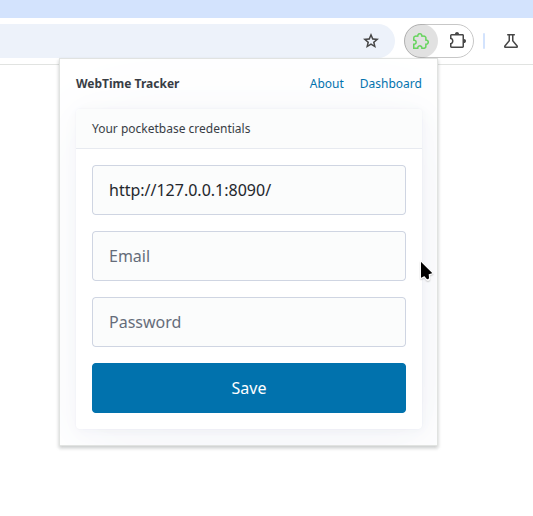

# Time logger for browser tabs with NOT IDLE time

 

## Why?

There's a lot of good time trackers but all of them manipulating with just domain names like google.com and it's not really helps with analyze. 

For example, if you want to track if there's any difference between googling:
- a cat picture
- how to center div

It'll be just google.com

The reason of this is ["the limited storage provided by Chrome for each extension"](https://github.com/sheepzh/time-tracker-4-browser/issues/261#issuecomment-1958738916)

## How to bypass localstorage limits?

Just using a extenal server that can hold data like it does wakatime, but locally.

So this project will seperated to 2 parts:
- Server
- WXT Extension

WXT Extension just have to provide statistics about how much time you spend on every URL (not domain, see "Why?" above)

And export to CSV for future analyzing.

## Table structure

### statistics

- id
- URL
- createdAt
- Page title, like: "Cats picture - Searching in Google"
- Amount of time in seconds

## Versions

- fairy-tails (v0.4)
| Ready to use really simple version, that use pocketbase as server
| Not ready CSV imports, and by this reason you have to export data from
| sqlite file of pocketbase directly